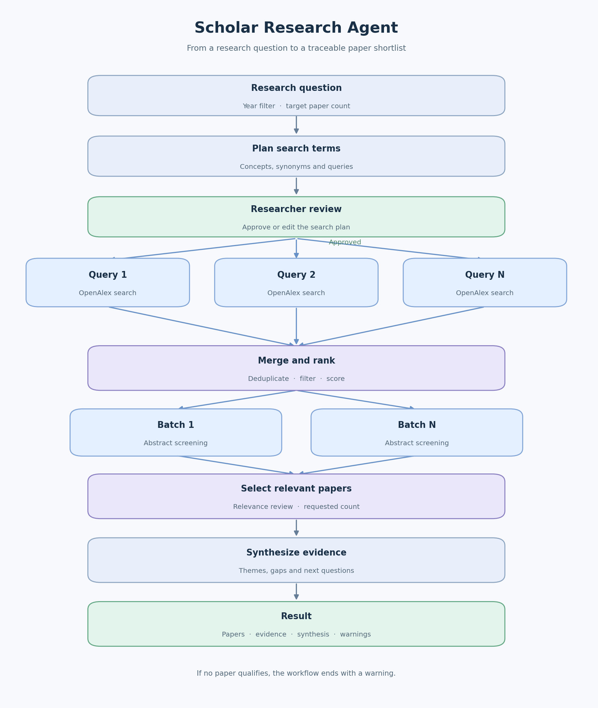

# Scholar Research Agent

A research agent for finding, screening and summarizing scientific papers. The researcher reviews the search plan before retrieval starts.

## Workflow

1. Extract concepts and draft 2–6 English search queries from the research question.
2. Pause for the researcher to approve or edit concepts and queries. Set a minimum publication year and target paper count before starting.
3. Search OpenAlex in parallel using LangGraph `Send`. Combine branch outputs with reducers.
4. Deduplicate DOI/title matches, remove retracted works and apply year and exclusion filters.
5. Rank candidates using concept coverage (55%), total citations (15%), citations per year (15%) and recency (15%). These weights are heuristics, not quality measures.
6. Screen titles and available abstracts in parallel. Keep only records rated at least 2/3 for relevance.
7. Synthesize evidence and export Markdown and structured JSON, including URLs, score components, search queries and warnings.



Generate the diagram from the current LangGraph workflow:

```bash
pip install -e '.[viz]'
scholar-agent --graph
```

## Start

Python 3.11+ is required. An OpenAI API key is required for planning, screening and synthesis. OpenAlex allows basic keyless requests, but a free API key increases the daily usage budget. Set `OPENALEX_API_KEY` for regular use. Check current rates before a public launch. LangSmith is optional.

```bash
python -m venv .venv
source .venv/bin/activate
pip install -e '.[dev,viz]'
cp .env.example .env
# Set OPENAI_API_KEY and, if required, OPENALEX_API_KEY in .env.
scholar-agent "How can RAG improve predictive maintenance diagnosis?" --min-year 2020 --count 10
pytest -q
```

On Windows activate with `.venv\Scripts\activate`. At the review prompt use `y` to approve, `e` to edit queries and concepts, or `n` to cancel. Output goes to `reports/latest/report.md` and `result.json`. The `.env` and reports are excluded from Git.

## View the graph in LangSmith Studio

Install the local server and start it from the project directory:

```bash
pip install -U "langgraph-cli[inmem]"
langgraph dev
```

Add `OPENAI_API_KEY` and `LANGSMITH_API_KEY` to `.env` first. Open the Studio URL shown in the terminal (normally `https://smith.langchain.com/studio/?baseUrl=http://127.0.0.1:2024`). Studio shows the graph and lets you inspect nodes and runs. On Safari, use `langgraph dev --tunnel` and connect the tunnel URL in Studio. A test run begins with an input such as:

```json
{"request": {"question": "How can RAG improve predictive maintenance diagnosis?", "min_year": 2020, "paper_count": 10}}
```

The graph pauses at `review`. Resume it in Studio with `{"approved": true}`, or edit the search plan using `queries` and `concepts`. `LANGSMITH_TRACING=true` also records the run in the tracing project named by `LANGSMITH_PROJECT`.

## Design decisions and limits

- Search uses scholarly metadata from OpenAlex, not Wikipedia. Queries are plain text; avoid Boolean operators. A DOI and an OpenAlex URL are retained for every paper. Abstracts can be missing.
- Citations identify influential records but are field and age dependent. High citation count does not prove study quality. The LLM relevance screen can make mistakes; the researcher should inspect included papers.
- The report uses titles and abstracts, not full texts. It cannot verify experimental results, assess risk of bias, or claim systematic-review completeness. A requested count is a target, not a guarantee.
- `InMemorySaver` keeps the interactive CLI run in memory until the process ends.
- The workflow does not fetch or redistribute copyrighted PDFs. The PDF link is metadata for openly available locations.
- Search failures are reported; successful branches continue. Unexpected LLM/schema failures stop the run rather than silently inventing evidence.

